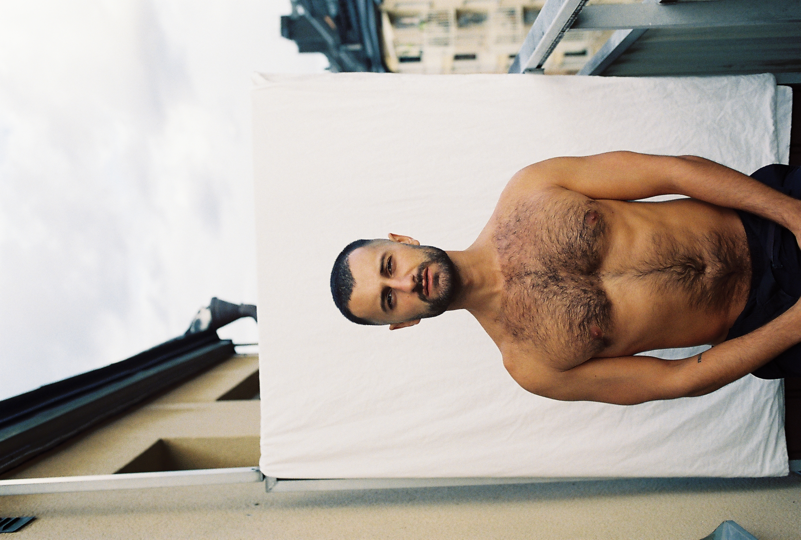

My interview with the dancer and choreographer Ninos Josef was not until a good while, yet I was already outside of his apartment in trendy Södermalm, Stockholm. This was deliberate; when mentioning to acquaintances that I was going to interview Ninos, they all had made this face and cautioned me to be prepared for a challenging and intellectually difficult conversation. When, during the interview, I felt comfortable bringing this up with Ninos, his comment was: “You have heard that I am an angry foreigner”.

Ninos Josef is an internationally acclaimed modern and neo-classic dancer, with a repertoire from some of the most renowned dance companies in the world. Despite having performed at The Royal Swedish Opera, he still has difficulties getting the dance jobs he believes to be qualified for. At one time he was denied a job overtly due to his skin color – it was too dark. His former principal at the Royal Swedish Ballet School had warned him about this, there was no market for Ninos’ talent in Sweden, and he would do best to move abroad.  For three hours Ninos and I discussed the white supremacy, suicide thoughts, and what have made Ninos the one he is today. 