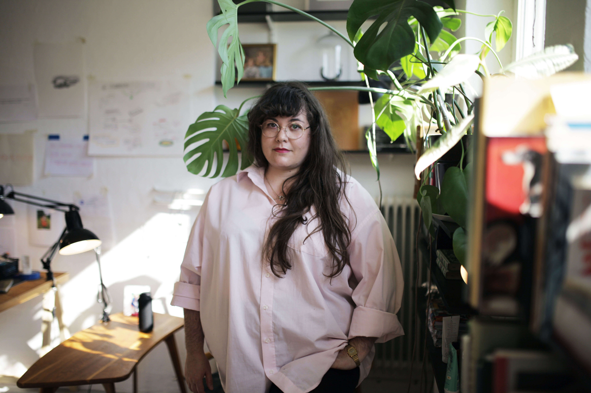

<!--  -->

The Malmö-based visual artist and doctorate student, EvaMarie Lindahl, wants us to question the notion that animals (non-human animals) are that different from us. Why? Because in the current commodification and exploitation of animals for food and materials, we are not only hurting animals but also ourselves. Each person's participation is hinged on the suppression of any thoughts and feelings about this exploitation – it comes at the cost of denying parts of ourselves. Further, to partake in the exploitation of animals is to support the use of the same mechanisms of oppression at work in the oppression of humans; oppression looks the same regardless of whether the victim is a woman, person of color, disabled person, or animal. 

As a student of Critical Animal Studies, EvaMarie started making this connection. Dissatisfied with how animals are portrayed in historical art – as mere symbols or objects for humans to use – she initiated the interdisciplinary research project “Re-framing the Non-Human Animal in Art Production” where she recreates portraits to give the animals back their personhood.